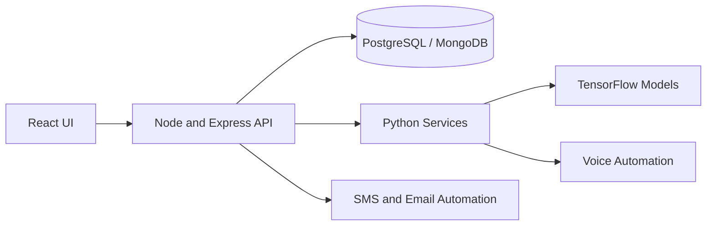
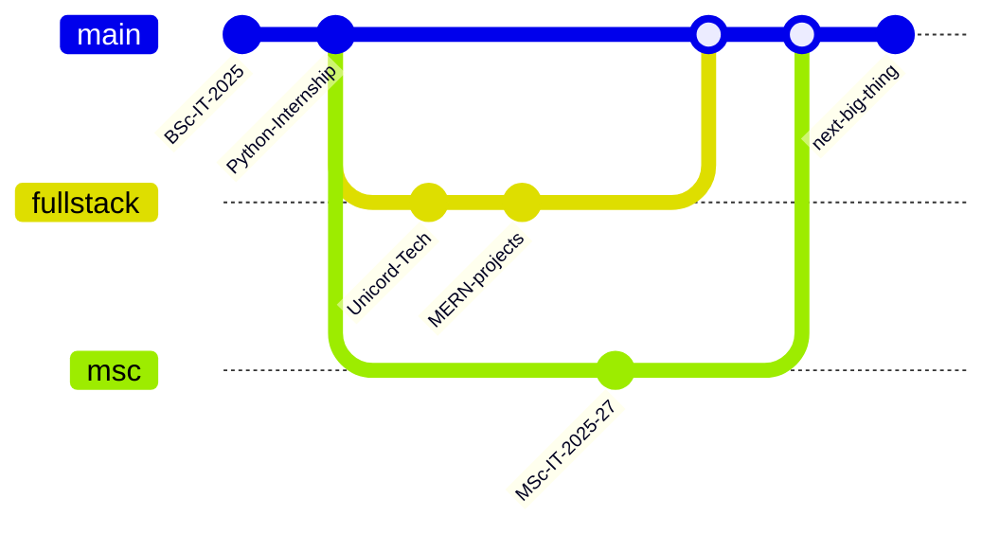

<div align="center">


<br/>


</div>

---

## 📦 `package.json`

```json
{
  "name": "amit",
  "alias": "ROOKIEEE12",
  "version": "2.0.0",
  "description": "Full Stack Developer building web apps, AI tools and automation",
  "author": "Amit @ Unicord Tech",
  "location": "Palghar, India",
  "education": "M.Sc. IT, Mumbai University (2025-2027)",
  "main": "ship.js",
  "scripts": {
    "dev": "build --web --ai --automation",
    "learn": "leetcode --python --daily",
    "freelance": "upwork --role fullstack",
    "coffee": "not-found"
  },
  "dependencies": {
    "frontend": ["React", "JavaScript", "HTML5", "CSS3"],
    "backend": ["Node.js", "Express", "REST APIs"],
    "database": ["PostgreSQL", "MongoDB", "SQLite"],
    "ai-ml": ["Python", "TensorFlow", "CNN"],
    "tools": ["Git", "GitHub"]
  },
  "keywords": ["fullstack", "mern", "python", "automation", "ai"]
}
```

---

## 🖥️ System Boot Log

```bash
$ ./boot-amit.sh

[  OK  ] Loaded module: React ........................ frontend
[  OK  ] Loaded module: Node + Express ............... backend
[  OK  ] Loaded module: PostgreSQL / MongoDB ......... database
[  OK  ] Loaded module: Python + TensorFlow .......... ai-ml
[  OK  ] Started service: Unicord Tech ............... full-time
[  OK  ] Mounted: Mumbai University M.Sc. IT ......... 2025-2027
[ RUN  ] Process: DSA on LeetCode .................... in progress
[ RUN  ] Process: Freelance profile .................. in progress

System ready. Waiting for the next idea...
```

---

## 🧬 How My Stack Fits Together



---

## ⚡ Tech Arsenal

<div align="center">

**Frontend**<br/>


**Backend**<br/>


**Database**<br/>


**AI / ML**<br/>


**Tools**<br/>


</div>

---

## 🚀 Featured Repos

<div align="center">

<a href="https://github.com/ROOKIEEE12/Market-Direct"></a>
<a href="https://github.com/ROOKIEEE12/Code_Crew"></a>
<a href="https://github.com/ROOKIEEE12/GYM_WEBSITE"></a>
<a href="https://github.com/ROOKIEEE12/Sundown"></a>

</div>

### 🔧 More Builds

| Project | What it does | Stack |
| :--- | :--- | :--- |
| 🏥 **MedCore** | Hospital management: patients, doctors, billing, appointments, records | React, useReducer |
| 🎙️ **Mr. Monday** | Voice-controlled automation assistant | Python, Node.js, React |
| 🩸 **Blood Donation Platform** | Connects donors and recipients, SMS and email automation | MERN |
| 💵 **Currency Detection** | CNN-based currency note recognition | Python, TensorFlow |
| 🖥️ **Internship desktop apps** | Three desktop applications at BizTech IT Solutions | Python, NiceGUI, SQLite |

---

## 🌿 My Dev Journey (git graph)



---

## 📊 GitHub Analytics

<div align="center">


</div>

---

## 📡 Connect

<div align="center">

[](https://github.com/ROOKIEEE12)
[](https://www.linkedin.com/in/YOUR-HANDLE)
[](mailto:YOUR-EMAIL)
[](https://www.upwork.com/freelancers/YOUR-HANDLE)

<br/>


</div>
